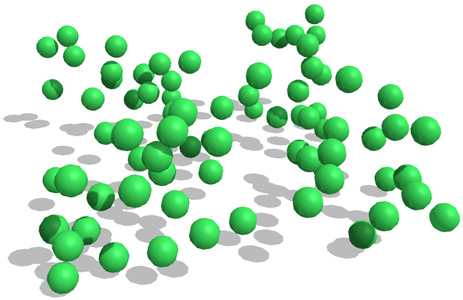

# Game Physics

After implementing far too many collision detection algorithms in my various experiments and games since 2009, I've decided enough is enough and compiled this tiny library of just the raw math behind collision detection and physical response.

It is meant to provide the minimal (and in most cases sufficient) system necessary for creating high performance real-time applications with dynamic objects interacting with each other.

Features:
* Detection and response for axis-aligned 2D and 3D boxes and spheres
* Signal dispatch on collision that provides a manifold describing the collision (and with what, obviously)
* "World" class with friction, gravity, and boundaries (infinity works too)
* Memory-efficient broadphase (2D static grid)

Bonus 2D and 3D wandering behavior in the examples.

## Full engines with readable code

These are engines that have fancy things like rotational torque, joints, and so on. If you want a "physics-based" game, use one of these instead. Or just use [Unity](http://unity3d.com/), let's be honest. The web is terrible for games, if only because you can't safeguard your assets. Great for prototyping though, with the [right tools](https://github.com/vonWolfehaus/von-component) :wink:

* [sat](https://github.com/jriecken/sat-js)
* [Oimo](https://github.com/lo-th/Oimo.js)
* [PhysicsJS](https://github.com/wellcaffeinated/PhysicsJS)
* [p2](https://github.com/schteppe/p2.js)
* [newton](https://github.com/hunterloftis/newton)
* [Cannonjs](https://github.com/schteppe/cannon.js)
* [Coffee physics](https://github.com/soulwire/Coffee-Physics/blob/master/source/behaviour/Collision.coffee)
* [Impulse](https://github.com/dubrowgn/Impulse.js/blob/master/src/Shape2D.js)
* [Matter](http://brm.io/matter-js/)
* [microphysics](https://github.com/jeromeetienne/microphysics.js) - I used this for the 3D stuff here
* [phys](https://github.com/AbhiAgarwal/phys.js) - Algorithms for electromagnetics, thermal, quantum, etc

## Resources

* [TutsPlus](http://gamedev.tutsplus.com/tutorials/implementation/create-custom-2d-physics-engine-aabb-circle-impulse-resolution)
* [ball collision](http://bluethen.com/wordpress/index.php/processing-app/do-you-like-balls/)
* [verlet particle physics](http://www.lonely-pixel.com/lab/jsverlet/)
* [balls vs quadratic curve](http://lonely-pixel.com/lab/ballcurves/)
* [Mozilla](https://developer.mozilla.org/en-US/docs/Games/Techniques/2D_collision_detection)
* [flocking done well](http://bluethen.com/wordpress/index.php/processing-app/flock-ai/)

## Other tricks

* [Broadphase techniques](https://github.com/reu/broadphase.js)
* [Efficient ray casting](http://gamedev.stackexchange.com/questions/18436/most-efficient-aabb-vs-ray-collision-algorithms)
